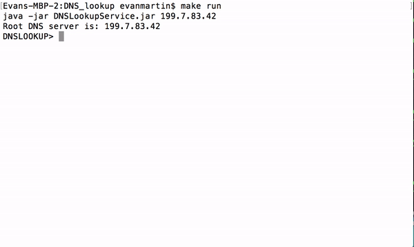

# DNS_lookup
This code implements a scaled-back DNS resolver client. The user inputs a domain name and the DNS resolver client will return the IP address currently associated with that domain name. Information is also cached to speed up further lookups 

###usage

```lookup < domain-name >``` performs a DNS lookup on the given domain name.

```trace < on/off >``` turns on lookup tracing. This allows the user to understand the route the program took through the DNS hierarchy to reach the returned IP address.

``` server IP ``` changes the DNS server to start future searches from. 

```dump``` prints the cache.

```quit``` quits the process.

###usage examples

```lookup < domain-name > []```  

  

Here we perform a DNS lookup on the *google.com*, *facebook.com* and *github.com*. 

For the first query, we get the answer ```google.com A 300 172.217.3.206```, which tells us that the query was to *google.com*, that this is an answer, that the time-to-live is *300* and finally that the IP address is *172.217.3.206*. 

```trace < on/off >```

  

Here we perform a DNS lookup on *google.com* with tracing on. Our client first queries the l-root server at IP address 199.7.83.42. The l-root server responds with a list of *com* nameservers. We select the first *com* nameserver and query it for the IP of *google.com*, as we queried the l-root server. The *com* nameserver will respond with a list of nameservers for which we will query and so on until we reach the server responsible for *google.com*, which has IP address *172.217.3.206*.

The full output of this command can be found in the appendix below.

```dump``` 


Here we first perfom a DNS lookup on *google.com* again and receive an IP address. We then perform a ```dump``` command which will print out all the cached information. This information is a lot of the same information that was printed when we called perform thed lookup with tracing on. 

The full output of this command can be found in the appendix below.

### Appendix

tracing for *lookup google.com*:

~~~
DNSLOOKUP> lookup google.com


Query ID     62410 google.com  A --> 199.7.83.42
Response ID: 62410 Authoritative = false
  Answers (0)
  Nameservers (13)
       com                            172800     NS   a.gtld-servers.net
       com                            172800     NS   b.gtld-servers.net
       com                            172800     NS   c.gtld-servers.net
       com                            172800     NS   d.gtld-servers.net
       com                            172800     NS   e.gtld-servers.net
       com                            172800     NS   f.gtld-servers.net
       com                            172800     NS   g.gtld-servers.net
       com                            172800     NS   h.gtld-servers.net
       com                            172800     NS   i.gtld-servers.net
       com                            172800     NS   j.gtld-servers.net
       com                            172800     NS   k.gtld-servers.net
       com                            172800     NS   l.gtld-servers.net
       com                            172800     NS   m.gtld-servers.net
  Additional Information (14)
       a.gtld-servers.net             172800     A    192.5.6.30
       b.gtld-servers.net             172800     A    192.33.14.30
       c.gtld-servers.net             172800     A    192.26.92.30
       d.gtld-servers.net             172800     A    192.31.80.30
       e.gtld-servers.net             172800     A    192.12.94.30
       f.gtld-servers.net             172800     A    192.35.51.30
       g.gtld-servers.net             172800     A    192.42.93.30
       h.gtld-servers.net             172800     A    192.54.112.30
       i.gtld-servers.net             172800     A    192.43.172.30
       j.gtld-servers.net             172800     A    192.48.79.30
       k.gtld-servers.net             172800     A    192.52.178.30
       l.gtld-servers.net             172800     A    192.41.162.30
       m.gtld-servers.net             172800     A    192.55.83.30
       a.gtld-servers.net             172800     AAAA 2001:503:a83e:0:0:0:2:30


Query ID     54875 google.com  A --> 192.5.6.30
Response ID: 54875 Authoritative = false
  Answers (0)
  Nameservers (4)
       google.com                     172800     NS   ns2.google.com
       google.com                     172800     NS   ns1.google.com
       google.com                     172800     NS   ns3.google.com
       google.com                     172800     NS   ns4.google.com
  Additional Information (4)
       ns2.google.com                 172800     A    216.239.34.10
       ns1.google.com                 172800     A    216.239.32.10
       ns3.google.com                 172800     A    216.239.36.10
       ns4.google.com                 172800     A    216.239.38.10


Query ID     25738 google.com  A --> 216.239.34.10
Response ID: 25738 Authoritative = true
  Answers (1)
       google.com                     300        A    216.58.193.78
  Nameservers (0)
  Additional Information (0)
google.com                     A     300      216.58.193.78
~~~

dump for *google.com*:

~~~
DNSLOOKUP> dump
a.gtld-servers.net             A     171659   192.5.6.30
a.gtld-servers.net             AAAA  171659   2001:503:a83e:0:0:0:2:30
b.gtld-servers.net             A     171659   192.33.14.30
c.gtld-servers.net             A     171659   192.26.92.30
com                            NS    171659   f.gtld-servers.net
com                            NS    171659   k.gtld-servers.net
com                            NS    171659   a.gtld-servers.net
com                            NS    171659   b.gtld-servers.net
com                            NS    171659   d.gtld-servers.net
com                            NS    171659   j.gtld-servers.net
com                            NS    171659   h.gtld-servers.net
com                            NS    171659   e.gtld-servers.net
com                            NS    171659   l.gtld-servers.net
com                            NS    171659   c.gtld-servers.net
com                            NS    171659   m.gtld-servers.net
com                            NS    171659   g.gtld-servers.net
com                            NS    171659   i.gtld-servers.net
d.gtld-servers.net             A     171659   192.31.80.30
e.gtld-servers.net             A     171659   192.12.94.30
f.gtld-servers.net             A     171659   192.35.51.30
g.gtld-servers.net             A     171659   192.42.93.30
google.com                     NS    171659   ns3.google.com
google.com                     NS    171659   ns1.google.com
google.com                     NS    171659   ns4.google.com
google.com                     NS    171659   ns2.google.com
h.gtld-servers.net             A     171659   192.54.112.30
i.gtld-servers.net             A     171659   192.43.172.30
j.gtld-servers.net             A     171659   192.48.79.30
k.gtld-servers.net             A     171659   192.52.178.30
l.gtld-servers.net             A     171659   192.41.162.30
m.gtld-servers.net             A     171659   192.55.83.30
ns1.google.com                 A     171659   216.239.32.10
ns2.google.com                 A     171659   216.239.34.10
ns3.google.com                 A     171659   216.239.36.10
ns4.google.com                 A     171659   216.239.38.10
~~~
